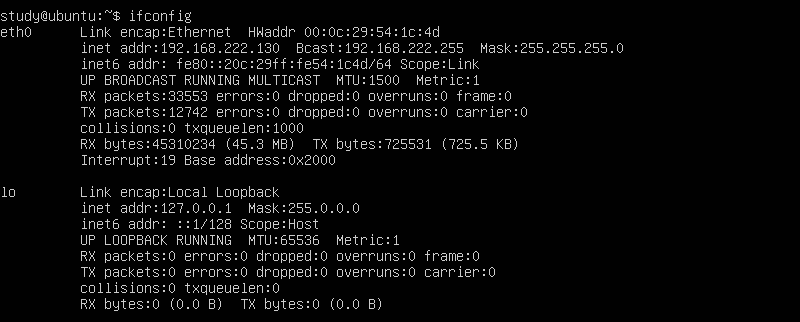
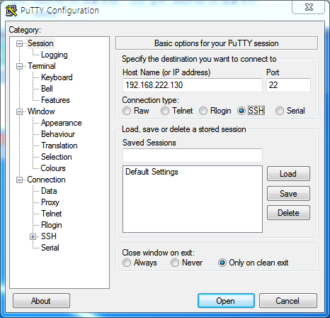
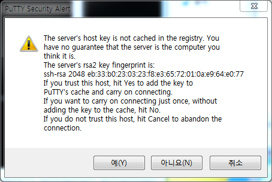
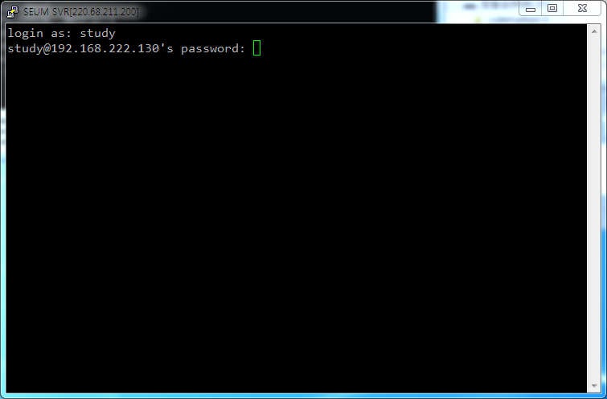
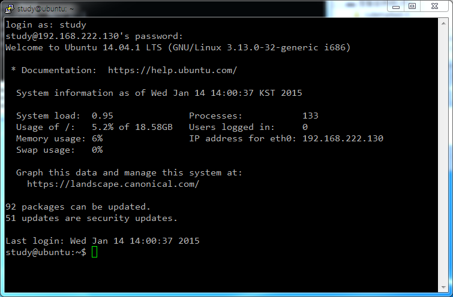
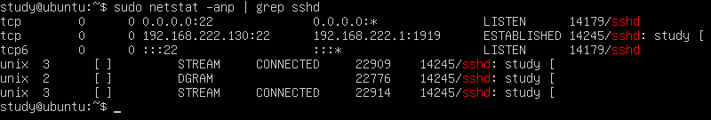

# OpenSSH Server

## 서버

### 설치

```bash
$ sudo apt-get install ssh
```

### 서버 실행

```bash
$ sudo service ssh start
```

### 서버 중지

```bash
$ sudo service ssh stop
```

### 서버 재실행

```bash
$ sudo service ssh restart
```

### 보안을 위한 포트 변경

```bash
$ sudo nano /etc/ssh/sshd_config
```

`Port 22`의 `22`를 원하는 포트 번호로 바꾸어 준다.

### 서버 재실행

## 클라이언트 - PuTTY 

### 다운로드

http://www.chiark.greenend.org.uk/~sgtatham/putty/download.html

http://the.earth.li/~sgtatham/putty/latest/x86/putty.exe

### 서버 아이피 주소 확인

```bash
$ ifconfig
```



### 설정



### 서버 연결







###SSH를 통해 접속한 사용자 확인

```bash
$ who
```


###SSH 서비스 포트 확인

```bash
$ sudo netstat -anp | grep sshd
```



