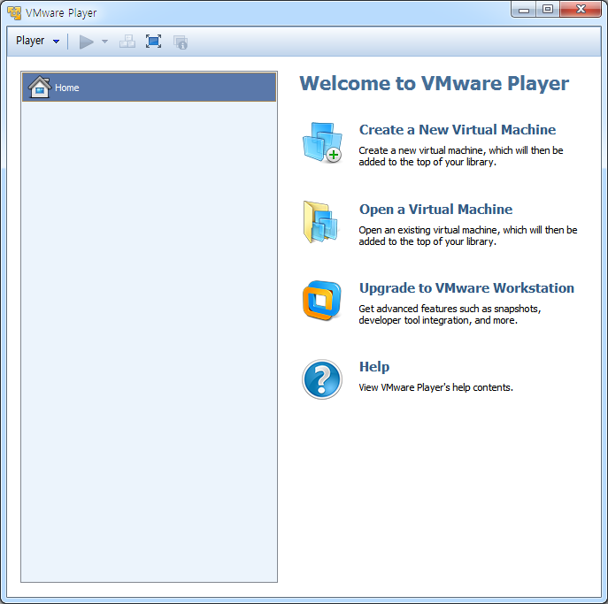
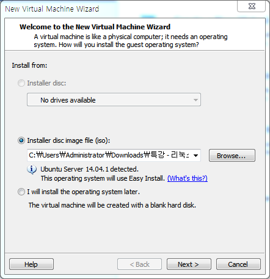
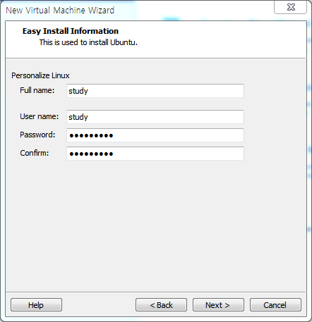
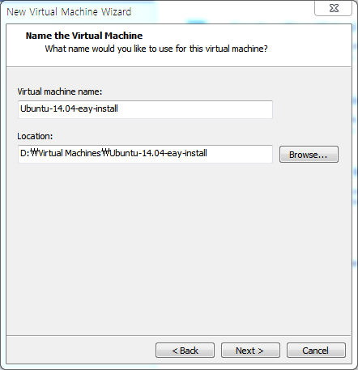
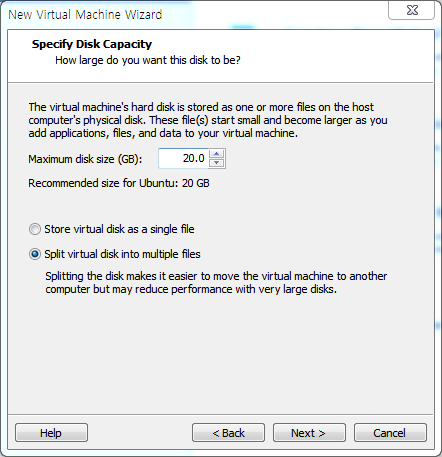
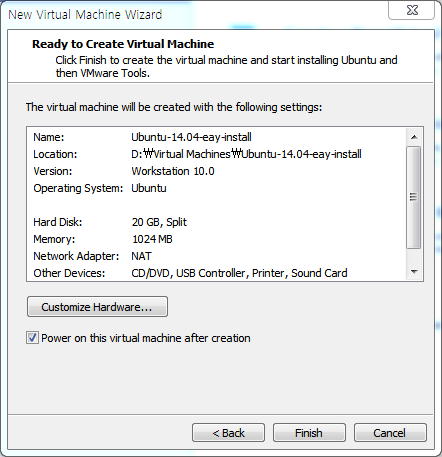
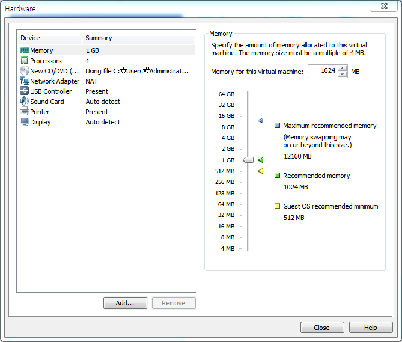
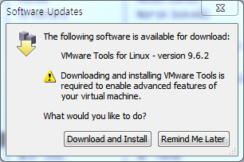
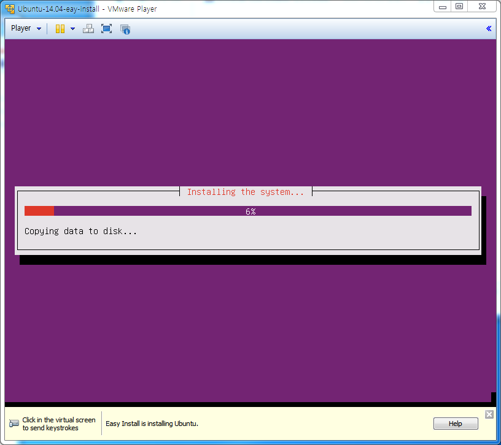
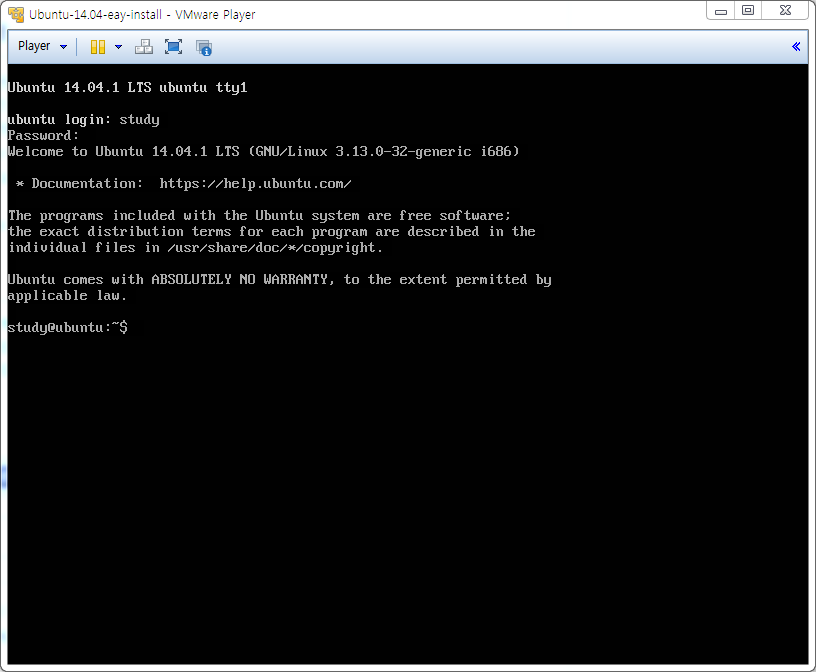

# VMWare Player의 쉬운 설치를 이용한 우분투 설치

## 새로운 가상 머신 생성

### Create a New Virtual Machine 선택

새로운 가상 머신을 생성하기 위해서 `Create a New Virtual Machine` 메뉴를 클릭한다.

### 운영체제 설치 방법 선택

쉬운 설치를 통해서 자동으로 설치할 예정이므로 `Installer disc image file (iso):`의 `Browse...`를 눌러서 설치를 원하는 리눅스 이미지를 선택한다.

만일 물리적으로 연결된 `CD/DVD`를 이용해서 설치할 예정이라면 `Installer disc:`를 선택해서 진행한다.

### 사용자 이름, 아이디, 비밀번호 입력

쉬운 설치를 통해 자동으로 입력할 정보를 입력한다.

### 가상 머신 이름과 위치 설정

생성할 가상 머신 이름 및 위치할 폴더를 선택한다.

### 저장 공간 설정

할당할 저장 공간 크기 및 할당 방법을 선택한다. 기본 크기인 `20GB`를 사용하며 필요한 경우 하드디스크 이미지를 추가서 생성해서 연결이 가능하다.

* Store virtual disk as a single file

설정한 크기의 용량 만큼의 하나의 파일을 생성해서 사용한다. 

* Split virtual disk into multiple files

여러개로 나누어진 파일을 사용한다. 가상 머신 공간이 늘어날 때마다 크기가 늘어나며 설정한 크기 이상으로 늘어날 수는 없다.

### 기본 설정 완료

생성할 가상 머신의 기본 정보를 보여준다. 하드웨어 정보를 수정하고 싶은 경우 `Customize Hardware...`를 눌러 재설정 할 수 있다.

### 가상 머신 하드웨어 정보 설정

생성된 가상 머신 하드웨어 기본 정보는 다음과 같으며 기본 설정을 그대로 사용한 것이다.

## 리눅스 설치

### VMWare Tools for Linux 질문

만일 설치를 시작 하는 화면에서 `VMWare Tools for Linux`에 대한 질문이 나오면 나중에 설치할 수 있으므로 `Remind Me Later`를 선택한다.

### 자동 설치 진행

리눅스 설치 과정에서 입력한 정보를 바탕으로 자동으로 필요한 정보를 알아서 입력하면서 설치하게 된다.

### 설치 완료 후 로그인 화면

설치가 완료되면 자동으로 재시작되며 쉬운 설치 정보에서 입력한 아이디 및 비밀번호를 입력하여 로그인을 진행한다.

